# Fiji Plugin

## Installation

For the image analysis you need to download and install Fiji: [Link to Fiji](https://fiji.sc/). 
The plugin is available via an update site. Add the Cellular-Imaging site:

1. Select **Help › Update…** from the menu bar. This will install potential updates and open a new window.
2. Click on **Manage update sites**. Which opens the Manage update sites dialog.
3. Search for the **Cellular Imaging** update site in the list.
4. Add the update site by setting the tick box.
5. Press **Close** and then **Apply** changes.
6. The SynActJ should appear with the Status: **Install it**.
7. Press **Apply changes** wait for download to finish and restart Fiji.

## Start and loading data
1. Start Fiji
2. Open SynActJ
    **_Fiji > Plugins  > Cellular Imaging > SynActJ_**
3. **_Setup dialog_** pops up

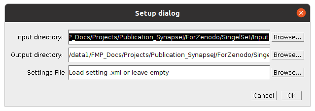

A log file and a Setup dialog will appear. Specify the input and output directory. A settings file can be provided or left empty.

Press **_ok_** to continue.

## SynActJ Processing

SynActJ will search recursively in the specified input directory for .tif files. The SynActJ preview window will open. All the available input files will be displayed in the file list.

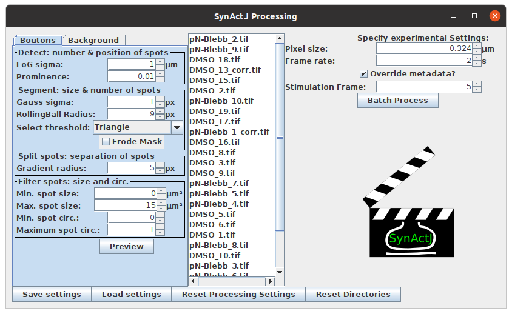

- **Left section:** contains tabs and allows to test different settings for the segmentation of the Boutons and the Background.

- **Middle section:** the available files can be selected.

- **Right section:** experimental settings such as image calibration, stimulation frame can be specified and the batch processing can be executed.

- **Bottom section:** save, load and reset the settings as well as reset the directories.

## Save, load, reset settings and reset directories

Different setting files can be saved and loaded. The reset Button will restore the processing setting to the system default. If you want to process a different dataset or store the output files in a different output directory you can press Reset Directories:

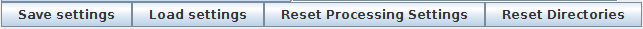

The workflow stores the experimental settings in a .xml file. This is a machine readable text file. You can open it with any text editor. The file is stored with the date and time when it has been saved:

*\<Date\>\-\<Time\>\-settings.xml*.

Each setting relevant for the processing is stored with the name of the specific setting.

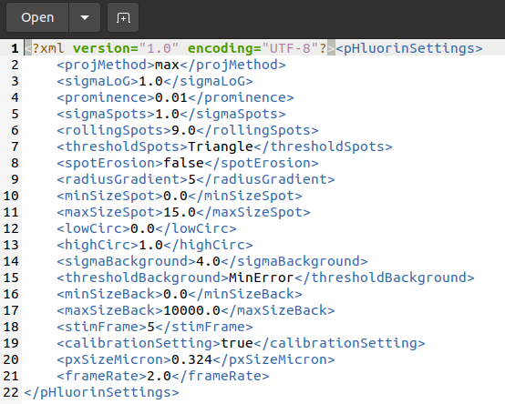

## Specify experimental settings

Verify if this is correct since segmentation parameters and the units of the measurements are depending on this setting. Modify this value and click the **_override metadata_** button if necessary.

*Pixel size:* the pixel size of the loaded dataset is displayed.

*Frame rate:* the frame rate in seconds.

*Stimulation Frame:* specifiy the frame were the stimulation has been applied.

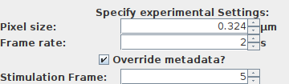

## Preview Boutons segmentation

To test the segmentation select an image title in the middle pane of the processing window. Then select the segmentation task by selecting the tab **Boutons**. The settings are structured according to the image processing that is performed.

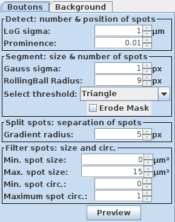

Change the parameters you want to optimize and the press **Preview**. A new image window will appear showing the movie overlayed with the segmentation based on the specified segmentation parameters:

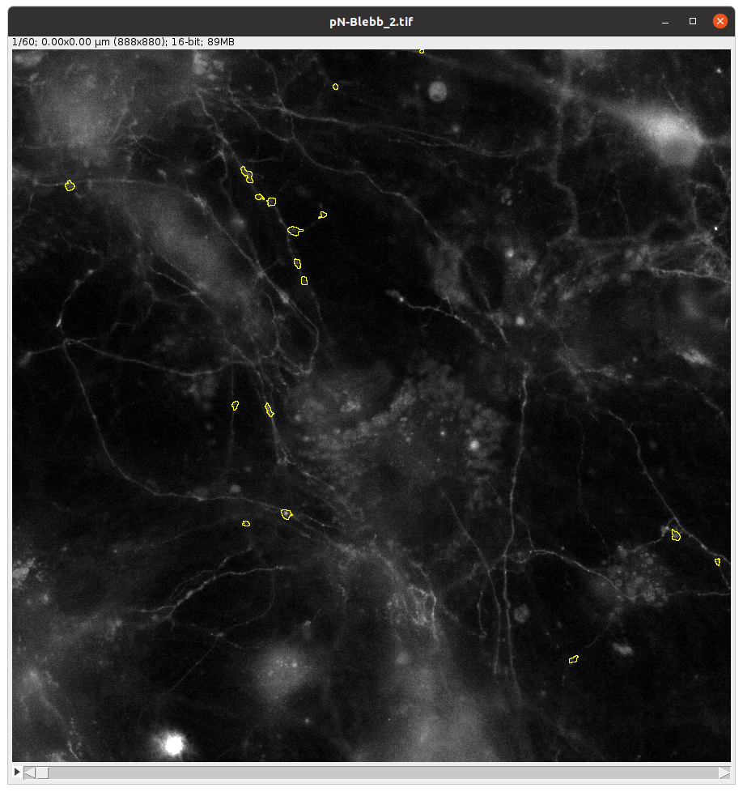

**IMPORTANT:** please make sure that the calibration is correct in the right window and override the existing metadata if necessary. Otherwise the segmentation might not work.

## Preview Background segmentation

For segmenting the background. Select the **Background** tab and adjust the segmentation parameters.

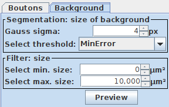

You can test the segmentation parameters using the **Preview** button:

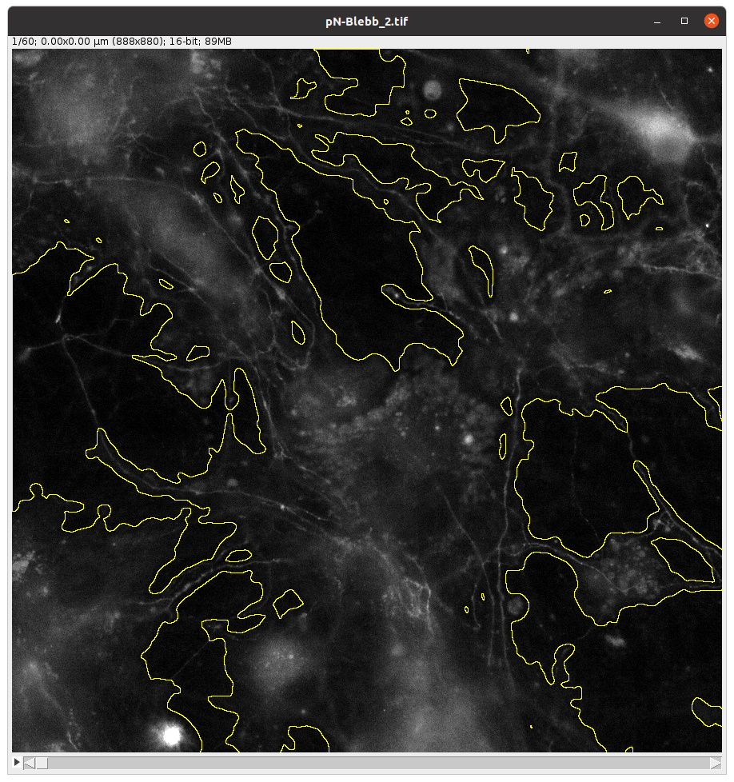

## Batch processing

Once you are happy with the segmentation you can execute the batch processing. This will perform the segmentation of the Boutons as well as the Background. Using this segmentation the fluorescent intensity traces over time are extracted from the movies. Press **Batch** Processing to execute the workflow with the specified segmentation parameters.

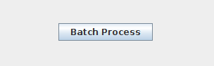

The log file will document the progress of the processing:

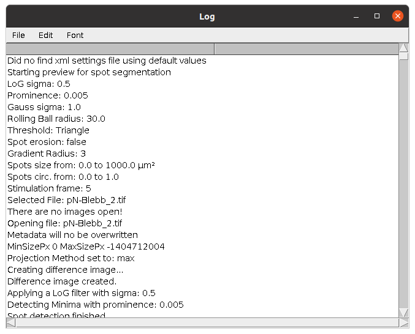

When the workflow is finished **Finished batch Processing** will appear in the log window.

# Results

The workflow will save a *\<timeStamp\>-settings.xml* as well as a *\<timeStamp\>-Log.txt* file into the output directory.

**IMPORTANT:** Please attach the log and settings file in bug reports.

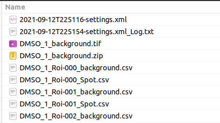

The workflow will save the input image as well as the segmentation as ImageJ ROIs for later review in the output folder

├── *\<filename\>_spot.tif* 
├── *\<filename\>_Spot.zip* 
├── *\<filename\>_background.tif* 
├── *\<filename\>_background.zip* 
├── *...* 
*...*

To review the segmentation **drag & drop** the input image and the ROI into ImageJ.
 
The measurements for the background as well as the bouton intensity over time are saved as .csv files for each ROI.

├── *...* 
├── *\<filename\>_ROI-\<number\>_background.csv* 
├── *\<filename\>_ROI-\<number\>_Spot.csv* 
├── *...* 
*...*
