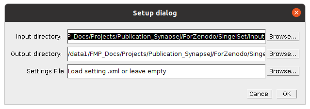
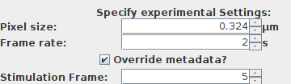

# SynActJ plugin tutorial

This tutorial introduces step by step how to adjust the segmentation parameters for the SynActJ processing from scratch.

For an overview of the SynActJ Fiji plugin head here: 
[SynActJ Plugin Overview](pages/Fiji_Plugin.html).

An overview of the data processing is provided here: 
[SynActJ R Shiny App](pages/SynActJ_Shiny.html).

## Test dataset

A test dataset for validating the plugin and data analysis workflow is provided here: [Test data](https://doi.org/10.5281/zenodo.5644945)

This dataset contains timelapse movies in TIFF format. The timelapse was generated from a hippocampal neuronal culture transfected with synaptophysin fused to pHluorin. The synapto-pHluorin assay was performed via electrical field stimulation at frame 5 for this test dataset in all the movies. Imaging was performed using epifluorescence microscopy with a 40X1.3 oil-immersion objective, with 2x2 camera binning and at 0.5 frames per second with 100ms exposure time. Drift and jittering was removed using the Correct 3D Drift plugin beforehand:
[Correct 3D Drift](https://imagej.net/plugins/correct-3d-drift)

Key requirements for new data:

<b>1. Optimized and consistent image acquistion:</b> frame rate, resolution, sampling (pixel size), exposure time, stimulation frame etc need to be the same accross the dataset.

<b>2. Sufficient stimulation:</b> The segmentation will depend on the strength of the signal increase upon stimulation. We tested the workflow for a minimum stimulation of 10 Hz for 5s for the pHluorin assay and 10 AP for the calcium imaging.

- **Note:** for analyzing low stimulations one can use a large stimulation for segmentation at the end of the movie, instead of basing the segmentation on the low stimuations.

<b>3. Correct drift and jittering:</b> Further large deformations of the tissue can lead to measurement error.

## Setting up the analysis

<b>1. Project input folder:</b> Movies should be located within one input folder. We recommend to keep the folder structure as flat as possible.

We also recommend that the filenames remain as short as possible and without spaces and only including numbers, letters as well as underscore and hyphens. Spaces and special signs should not be a problem for the plugin but can lead to problems in applying the downstream analysis out of the box.

<b>2. Result folder:</b> Please create for each batch analysis approach a new output folder.

<b>3. Start the plugin:</b>

1. Start Fiji
2. Open SynActJ
    **_Fiji > Plugins  > Cellular Imaging > SynActJ_**
3. **_Setup dialog_** pops up

<b>4. Setup dialog:</b> A log file and a Setup dialog will appear. Specify the input and output directory. A settings file can be provided or left empty.

Press **_ok_** to continue.

<b>5. Preview:</b> SynActJ will search recursively in the specified input directory for .tif files. The SynActJ preview window will open. All the available input files will be displayed in the file list.

- **Left section:** contains tabs and allows to test different settings for the segmentation of the Boutons and the Background.

- **Middle section:** the available files can be selected.

- **Right section:** experimental settings such as image calibration, stimulation frame can be specified and the batch processing can be executed.

- **Bottom section:** save, load and reset the settings as well as reset the directories.

## Priming the workflow

<b>1. Pixel size:</b> Key settings depend on the correct pixel size. Verify before or alternatively type in the metadata and press **_override metadata_** if a change needs to be enforced for:

- ***Pixel size:*** the pixel size of the loaded dataset is displayed.

- ***Frame rate:*** the frame rate in seconds.

<b>2. Stimulation frame:</b> This is a key parameter since the image segmentation directly depends on the correct stimulation frame:

- ***Stimulation Frame:*** specifiy the frame were the stimulation has been applied.

<b>3. Permissive initial settings:</b> A important prerequisite to get a first coarse segmentation that can be easily adjusted and fine tuned is to set the first segmentation settings very permissively. Thus without any size restriction, very low detection threshold and small initial particle sizes. For this tutorial please use the following settings for demonstration:

<b>4. First coarse segmentation:</b> These permissive settings should lead to a slight over segmentation at the first try by pressing ***Preview***:

### Getting the first coarse segmentation

If you did not achieve a bit of oversegmentation then proceed with this section. Otherwise you can skip this part and go to fine tuning the segmentation.

The segmentation has two important parts with the indicated key settings:
  * Detect: number & position of spots - Prominence
  * Segment: size and number of spots - Select threshold

<b>1. Verify permissive settings:</b> Make sure that the Prominence in the detection is set low. Also choose small values for the LoG sigma and Gauss sigma. The initial aim is to detect and segment small structures and peaks in the signal response upon stimulation.

<b>2. Cycle through the thresholds: </b> Then try to explore different thresholds

Choose a different threshold setting if the entire image is filled with regions of interest:

Choose a different threshold setting if there are only a few ROIs with permissive :

With permissive detection settings there should be aover segmentation. Meaning some detections in the background and multiple ROIs should be per object of interest.

If this is achieved go ahead and start the fine tuning of the segmentation.

## Fine tuning the segmentation

<b>1. Tune number of detections:</b> Over or under segmentation for this workflow usually a result of too permissive detection settings. This can be easily adjusted by changing the detection. Increase the Prominence value and the LoG sigma to detect bigger objects that have above background signal response.

Make sure you use the slider to verify that detected objects are actual sginal responses visually.

<b>2. Size of segmentations:</b> Once the detection finds and locates the objects properly you can fine tune the size of the ROIs via the segmentation parameters: ***Gauss sigma*** and ***RollingBall Radius***.

<b>3. Splitting of objects:</b> Sometimes objects are not split correctly. Then it you can try to adjust the ***Gradient radius option***:

<b>4. Filter size of objects:</b> Finally you can adjust the size and shape of the objects via the

## Verify over different movies

Once you have achieved a good segmentation the SynActJ it is important to verify and adjust the segmentation on other movies.
From the dataset selection pane select other movies and press ***Preview***.

Since the quality of the movies can vary due to the sample or the acquisition we recommend to choose at least 5-10 of your movies to verify the segmentation. Try to find movies that are representative of the underlying image and sample quality variation.

Once you are satisfied with the performance of the segmentation you can proceed with the batch processing.

***NOTE:*** If you want to repeat the batch processing with different settings please create a new output directory.
