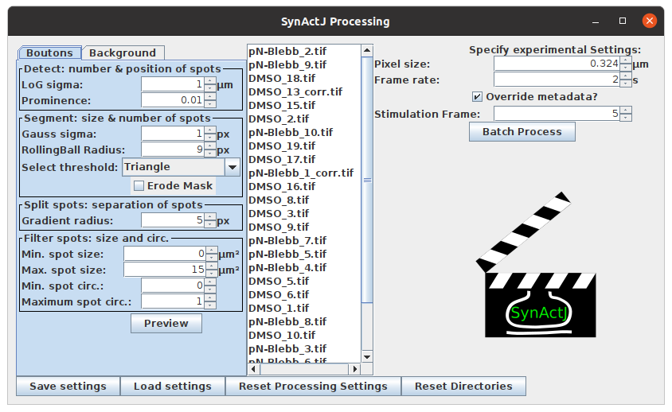

# SynActJ plugin tutorial

This tutorial introduces step by step how to adjust the segmentation parameters for the SynActJ processing from scratch.

For an overview of the SynActJ Fiji plugin head here: 
[SynActJ Plugin Overview](pages/Fiji_Plugin.html).

An overview of the data processing is provided here: 
[SynActJ R Shiny App](pages/SynActJ_Shiny.html).

## Test dataset

A test dataset for validating the plugin and data analysis workflow is provided here: [Test data](https://doi.org/10.5281/zenodo.5644945)

This dataset contains timelapse movies in TIFF format. The timelapse was generated from a hippocampal neuronal culture transfected with synaptophysin fused to pHluorin. The synapto-pHluorin assay was performed via electrical field stimulation at frame 5 for this test dataset in all the movies. Imaging was performed using epifluorescence microscopy with a 40X1.3 oil-immersion objective, with 2x2 camera binning and at 0.5 frames per second with 100ms exposure time.

Keep in mind that for the analysis to work robustly the image acquistion needs to be optimized and kept consistent. Thus the key acquistion parameters such as frame rate, resolution, sampling (pixel size), exposure time, stimulation frame etc need to be the same accross the dataset.

Drift and jittering was removed using the Correct 3D Drift plugin beforehand:
[Correct 3D Drift](https://imagej.net/plugins/correct-3d-drift)

## Setting up the analysis

The timelapse movies should be located within one input folder. Subfolders per experiment or per movie are permissible. However, we recommend to keep the folder structure as flat as possible.

We also recommend that the filenames remain as short as possible and without spaces and only including numbers, letters as well as underscore and hyphens. Spaces and special signs should not be a problem for the plugin but can lead to problems in applying the downstream analysis out of the box.

Please create for each batch analysis approach a new output folder. Once the dataset and folders are prepared start the plugin:

1. Start Fiji
2. Open SynActJ
    **_Fiji > Plugins  > Cellular Imaging > SynActJ_**
3. **_Setup dialog_** pops up

A log file and a Setup dialog will appear. Specify the input and output directory. A settings file can be provided or left empty.

Press **_ok_** to continue.

## Starting the plugin

SynActJ will search recursively in the specified input directory for .tif files. The SynActJ preview window will open. All the available input files will be displayed in the file list.

- **Left section:** contains tabs and allows to test different settings for the segmentation of the Boutons and the Background.

- **Middle section:** the available files can be selected.

- **Right section:** experimental settings such as image calibration, stimulation frame can be specified and the batch processing can be executed.

- **Bottom section:** save, load and reset the settings as well as reset the directories.

## Priming the workflow

Some settings of the workflow are dependent on the correct pixel size. So often there will be no preview segmentation available if the pixel size is incorrect. Thus verify in the movies that the files contain the correct pixel size. The workflow also allows to modify this value and click the **_override metadata_** button if a change needs to be enforced.

***Pixel size:*** the pixel size of the loaded dataset is displayed.

***Frame rate:*** the frame rate in seconds.

Please specify also the stimulation frame. This is a key parameter since the image segmentation directly depends on the correct stimulation frame:

***Stimulation Frame:*** specifiy the frame were the stimulation has been applied.

A important prerequisite to get a first coarse segmentation that can be easily adjusted and fine tuned is to set the first segmentation settings very permissively. Thus without any size restriction, very low detection threshold and small initial particle sizes. 

## First coarse segmentation

## Fine tuning the segmentation

## Verify over different movies

Once you have achieved a good segmentation the SynActJ it is important to verify and adjust the segmentation on other movies.
From the dataset selection pane select other movies and press ***Preview***.

Since the quality of the movies can vary due to the sample or the acquisition we recommend to choose at least 5-10 of your movies to verify the segmentation. Try to find movies that are representative of the underlying image and sample quality variation.

Once you are satisfied with the performance of the segmentation you can proceed with the batch processing.

## Verification of segmentation results
