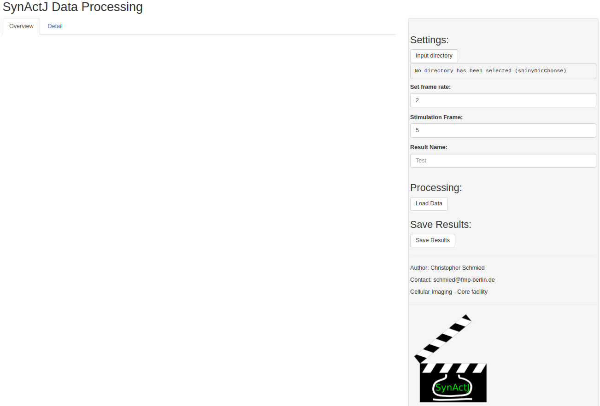
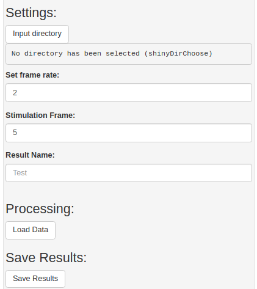
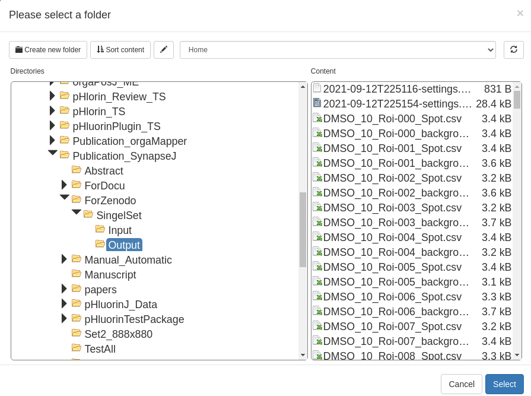
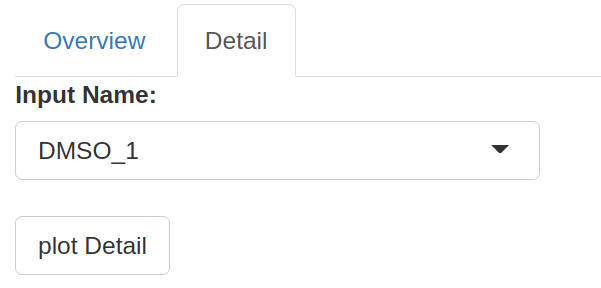
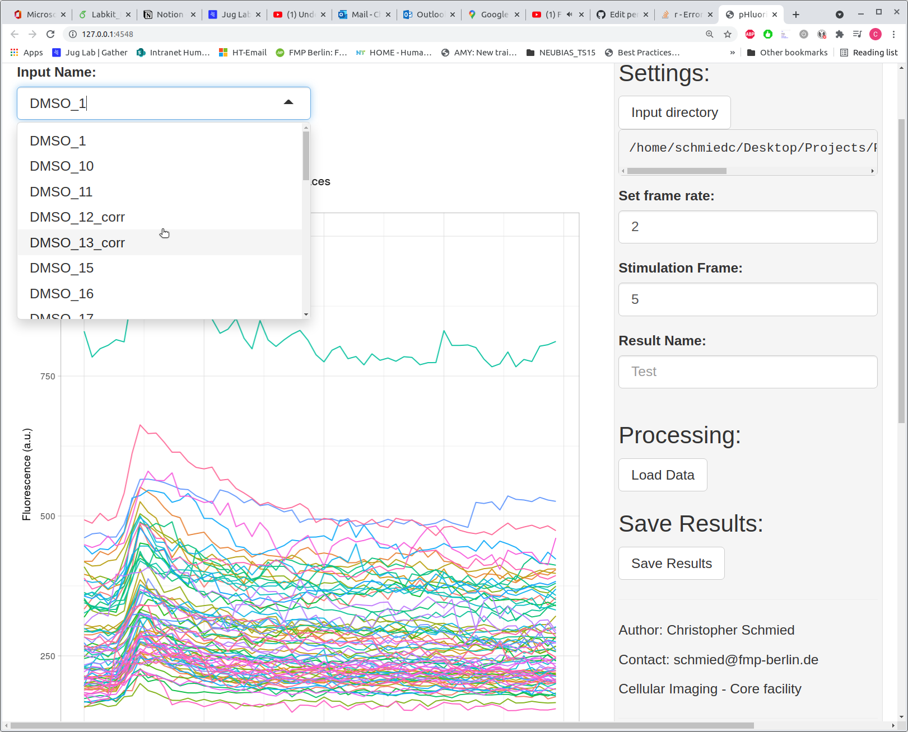
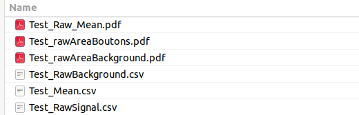
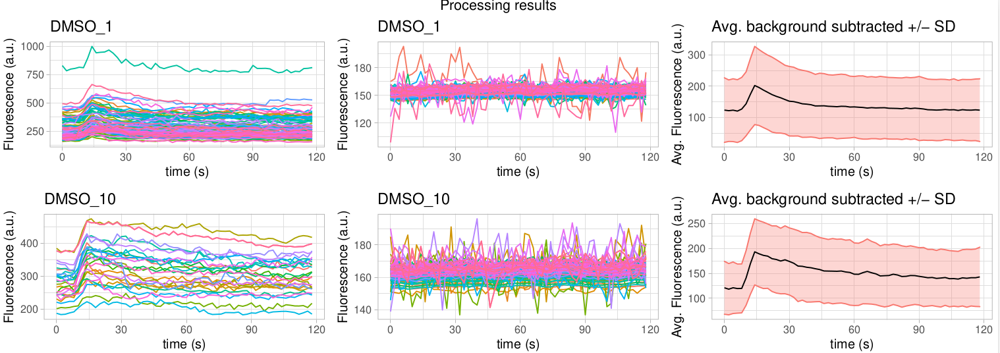

# Shiny App Setup

The data analysis is realized as a Shiny app. This allows you to read in the output data and execute the data processing using a graphical interface.

Install r and r studio for running the Shiny app: 
[https://www.r-project.org/](https://www.r-project.org/) 
[https://rstudio.com/products/rstudio/download/](https://rstudio.com/products/rstudio/download/) 

Then download the contents of the SynActJ_Shiny repository:
[SynActJ Shiny](https://github.com/schmiedc/SynActJ_Shiny)
Click on the green button Code.
Press **Download ZIP** to download the scripts.

Unzip the script to a location of your choice.
Then open the app.R file in RStudio. To start the application please press **Run App** in the top right corner of RStudio.

The application window will pop up.

# Data Processing

Press **Open in Browser** to have better more interactive window in your browser.
 
The GUI consists of two main parts. The main plotting window with two tabs (Overview and Detail) as well as the Settings tab.

In the settings tab you can specify the directory that contains the result files of the image analysis. You should then specify the frame rate as well as the stimulation frame. Optionally you can use a name for the result files.

Press **Input Directory** to enter the directory dialog and navigate to the correct folder and then press **Select**.

Then press **Load Data** in the settings interface. In the main window of the Shiny App plots will show the processed data in the **Overview** tab.

For a detailed view of the traces for each movie you can navigate to the **Detail** tab:

From the drop down menu you can select the movie and plot the individual traces for the regions of interest as well as the background:

## Processing Results

Press **Save Results** for saving the final tables and plots for quality control.
The files will be saved in the Input directory:

├──  *\<ResultName\>_Raw_Mean.pdf* 
├──  *\<ResultName\>_rawAreaBoutons.pdf* 
├──  *\<ResultName\>_rawAreaBackground.pdf* 
├──  *\<ResultName\>_RawBackground.csv* 
├──  *\<ResultName\>_Mean.csv* 
├──  *\<ResultName\>_RawSignal.csv* 
├── *...* 
*...*

**Raw_Mean.pdf** 
Contains the plots of the traces for each ROIs, the background as well as the averaged and background subtracted trace. For each movie these plots are shown side-by-side in order to promote quality control.

**RawAreaBoutons.pdf** 
Shows box plots for each movie of the area of the segmented ROIs.

**RawAreaBackground.pdf** 
Shows box plots for each movie of the area of the segmented background areas.

**RawBackground.csv** 
Contains the collected data table for the background traces.

**Mean.csv** 
 
Contains the processed traces for each movie
- Average of signal (mean.sig)
- Average of background (mean.back)
- Background subtracted average traces (mean.corr)
- Background subtracted and surface normalized traces (surf_norm)
- Background subtracted, surface and peak normalized traces (peak_norm)

**RawSignal.csv** 
Contains the collected data table of all traces per ROI.
